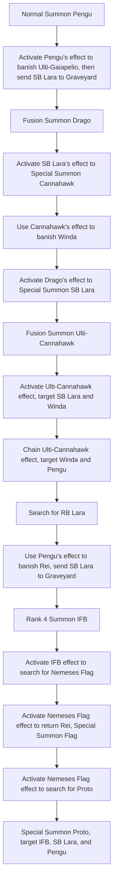

# Cannahawk

```mermaid
flowchart TD
    A["Summon Cannahawk"] --> B["Use Cannahawk's effect to banish SB Lara"]
    B --> C["Use SB Lara's effect to summon RB Lara"]
    C --> D["Fusion Summon Ulti-Cannahawk"]
    D --> E["Use Ulti-Cannahawk's effect, target RB Lara and SB Lara"]
    E --> F["Chain Ulti-Cannahawk effect, target SB Lara and Cannahawk"]
    F --> G["Search for Wen"]
    G --> H["Use Cannahawk's effect to banish Pengu"]
    H --> I["Link Summon Falco"]
    I --> J["Use Falco's effect to banish Cannahawk, then Normal Summon Wen"]
    J --> K["Use Wen's effect to Special Summon Pengu"]
    K --> L["Use Pengu's effect to banish Ulti-Gaiapelio and send Winda to Graveyard"]
    L --> M["Fusion Summon Drago, targeting Winda and RB Lara"]
    M --> N["Fusion Summon Ulti-Cannahawk"]
    N --> O["Activate Ulti-Cannahawk effect, target Wen and Pengu"]
    O --> P["Chain Ulti-Cannahawk effect, target Wen and Winda"]
    P --> Q["Search for Elder"]
    Q --> R["Link Summon Rei, leaving Winda on the field"]
    R --> S["Activate Rei's effect to return Cannahawk"]
    S --> T["Additional Normal Summon: Elder, then Cannahawk"]
    T --> U["Use Cannahawk's effect to banish Apelio"]
    U --> V["Fusion Summon Ulti-Cannahawk"]
    V --> W["Use Ulti-Cannahawk effect, target Elder and Cannahawk"]
    W --> X["Chain Ulti-Cannahawk effect, target Elder and Apelio"]
    X --> Y["Search for Steeds"]
    Y --> Z["Rank 4 into IFB"]
    Z --> AA["Activate IFB's effect to search for Nemeses Flag"]
    AA --> AB["Activate Nemeses Flag's effect, target Ulti-Gaiapelio"]
    AB --> AC["Activate Nemeses Flag's effect, search for Proto"]
    AC --> AD["Link Summon IP Masquerena, using Elder and IFB"]
    AD --> AE["Special Summon Proto, target IFB, Drago, Winda"]
    AE --> AF["Activate IFB effect, Special Summon IFB"]
```

# Pengu

```mermaid
flowchart TD
    A["Normal Summon Pengu"] --> B["Activate Pengu's effect to banish Ulti-Gaiapelio, then send SB Lara to Graveyard"]
    B --> C["Fusion Summon Drago"]
    C --> D["Activate SB Lara's effect to Special Summon Cannahawk"]
    D --> E["Use Cannahawk's effect to banish Winda"]
    E --> F["Activate Drago's effect to Special Summon SB Lara"]
    F --> G["Fusion Summon Ulti-Cannahawk"]
    G --> H["Activate Ulti-Cannahawk effect, target SB Lara and Winda"]
    H --> I["Chain Ulti-Cannahawk effect, target Winda and Pengu"]
    I --> J["Search for RB Lara"]
    J --> K["Use Pengu's effect to banish Rei, send SB Lara to Graveyard"]
    K --> L["Rank 4 Summon IFB"]
    L --> M["Activate IFB effect to search for Nemeses Flag"]
    M --> N["Activate Nemeses Flag effect to return Rei, Special Summon Flag"]
    N --> O["Activate Nemeses Flag effect to search for Proto"]
    O --> P["Special Summon Proto, target IFB, SB Lara, and Pengu"]

```
# Elder + Cannahawk

```mermaid
flowchart TD
    A["Normal Summon Elder, then Normal Summon Cannahawk"] --> B["Activate Cannahawk's effect to banish SB Lara"]
    B --> C["Fusion Summon Ulti-Cannahawk"]
    C --> D["Activate Ulti-Cannahawk effect, target SB Lara and Elder"]
    D --> E["Chain Ulti-Cannahawk effect, target Cannahawk and Elder"]
    E --> F["Search for Wen"]
    F --> G["Activate Cannahawk's effect to banish Pengu"]
    G --> H["Link Summon Falco"]
    H --> I["Activate Falco's effect to banish SB Lara, Normal Summon Wen"]
    I --> J["Activate Wen's effect to Special Summon Pengu"]
    J --> K["Activate SB Lara's effect to Special Summon Winda"]
    K --> L["Activate Pengu's effect to banish Ulti-Gaiapelio, send SB Lara to Graveyard"]
    L --> M["Fusion Summon Drago using SB Lara and Cannahawk"]
    M --> N["Rank 4 Summon IFB"]
    N --> O["Activate IFB effect to search for Nemeses Flag"]
    O --> P["Activate Nemeses Flag, return Ulti-Gaiapelio, Special Summon Nemeses Flag"]
    P --> Q["Search for Proto"]
    Q --> R["Link Summon Rei using Drago, IFB, and Flag"]
    R --> S["Activate Rei effect to return Cannahawk, Normal Summon Cannahawk"]
    S --> T["Activate Cannahawk's effect to banish Apelio"]
    T --> U["Fusion Summon Ulti-Cannahawk"]
    U --> V["Activate Ulti-Cannahawk effect, target SB Lara and Cannahawk"]
    V --> W["Chain Ulti-Cannahawk effect, target SB Lara and SB Lara"]
    W --> X["Search SB Lara or another follow-up"]
    X --> Y["Fusion Summon Ulti-Cannahawk"]
    Y --> Z["Activate Ulti-Cannahawk effect, target SB Lara and Wen"]
    Z --> AA["Chain Ulti-Cannahawk effect, target Wen and Apelio"]
    AA --> AB["Search Steeds"]
    AB --> AC["Activate Proto's effect, banish IFB, Falco, and SB Lara, Special Summon Proto"]
    AC --> AD["Activate IFB effect, Special Summon IFB"]
    AD --> AE["Activate Apelio effect to banish Winda"]
    AE --> AF["Fusion Summon Ulti-Gaiapelio"]

```

# Elder + Pengu

```mermaid
flowchart TD
    A["Normal Summon Elder, then Normal Summon Pengu"] --> B["Activate Pengu's effect to banish Ulti-Gaiapelio, send SB Lara to Graveyard"]
    B --> C["Fusion Summon Ulti-Cannahawk"]
    C --> D["Activate Ulti-Cannahawk effect, target Pengu and Ulti-Gaiapelio"]
    D --> E["Chain Ulti-Cannahawk effect, target Elder and Pengu"]
    E --> F["Search for RB Lara"]
    F --> G["Activate Pengu's effect, banish Ulti-Cannahawk, send Cannahawk to Graveyard"]
    G --> H["Link Summon Falco"]
    H --> I["Activate Falco's effect, banish SB Lara, Normal Summon RB Lara"]
    I --> J["Activate SB Lara's effect, chain RB Lara's effect to target Cannahawk, then target Winda"]
    J --> K["Use Cannahawk's effect to banish SB Lara"]
    K --> L["XYZ Summon IFB"]
    L --> M["Activate IFB effect, send Cannahawk to Graveyard"]
    M --> N["Search for Nemeses Flag"]
    N --> O["Activate Nemeses Flag's effect, return Ulti-Cannahawk, Special Summon Flag"]
    O --> P["Search for Proto"]
    P --> Q["Fusion Summon Drago using Cannahawk and Elder"]
    Q --> R["Link Summon Rei using Flag, IFB, and Falco"]
    R --> S["Activate Rei's effect, return Cannahawk, Normal Summon Cannahawk"]
    S --> T["Activate Cannahawk's effect to banish Apelio"]
    T --> U["Fusion Summon Ulti-Cannahawk"]
    U --> V["Activate Ulti-Cannahawk effect, target Cannahawk and SB Lara"]
    V --> W["Chain Ulti-Cannahawk effect, target SB Lara and SB Lara"]
    W --> X["Search for Pelica"]
    X --> Y["Fusion Summon Ulti-Cannahawk"]
    Y --> Z["Activate Ulti-Cannahawk effect, target SB Lara and Apelio"]
    Z --> AA["Chain Ulti-Cannahawk effect, target RB Lara and Apelio"]
    AA --> AB["Search for Steeds"]
    AB --> AC["Activate Proto's effect, banish IFB, Ulti-Gaiapelio, and Falco"]
    AC --> AD["Activate IFB effect, Special Summon IFB"]
    AD --> AE["Link Summon IP Masquerena"]

```

# Shifter + Pengu

```mermaid
flowchart TD
    A["Use Shifter"] --> B["Normal Summon Pengu"]
    B --> C["Use Pengu effect to banish Gaiapelio"]
    C --> D["Send Spiritual Tamer Lara to graveyard"]
    D -- Lara gets Banished Instead --> E["Activate Spiritual Tamer Lara"]
    E --> F["Special summon normal Lara"]
    F --> G["Fusion summon Ulti-Cannahawk"]
    G --> H["Activate Ulti-Cannahawk effect, Target Normal Lara and Pengu"]
    H --> I["Chain Ulti-Cannahawk, Target SB Lara and Pengu"]
    I --> J["Search for Wen"]
    J --> K["Use Pengu effect to banish Ulti-Cannahawk"]
    K --> L["Send Cannahawk to graveyard"]
    L -- Cannahawk gets Banished Instead --> M["Link falco"]
    M --> N["Activate falcos effect to banish RB lara and normal summon Wen"]
    N --> O["Use Wen to special summon Cannahawk"]
    O --> P["Use Cannahawk effect to banish winda"]
    P --> Q["Fusion summon Ulti-Cannahawk"]
    Q --> R["Activate Ulti-Cannahawk effect, Target SB Lara and Pengu"]
    R --> S["Search for Elder"]
    S --> T["Activate Ulti-Cannahawk effect, Target Wen and Winda"]
    T --> U["Fusion summon drago"]
    U --> V["Link summon Ulti-Rei, leave Winda"]
    V --> W["Use Ulti-Rei effect to search for Cannahawk, then normal summon Elder and Cannahawk"]
    W --> X["Use Cannahawk to banish Apelio"]
    X --> Y["Fusion summon Ulti-Cannahawk using Elder and Cannahawk"]
    Y --> Z["Use Cannahawk effect to return SB Lara and Pengu to graveyard"]
    Z --> AA["Search for Stead"]
    AA --> BB["Activate Ulti-Cannahawk effect, Target Elder and Apelio"]
    BB --> CC["Rank 4 into Infernal Flame Banshee"]
    CC --> DD["Activate IFB effect, send Apelio, search for Nemeses Flag"]
    DD --> EE["Special summon Nemeses Flag, return Ulti-Gaiapelio"]
    EE --> FF["Activate Nemeses Flag, search for Proto"]
    FF --> GG["Link IFB and Elder into IP Masq"]
    GG --> HH["IFB gets banished, special summon it"]
    HH --> II["Special summon Proto by banishing Shifter, Pengu and Nemeses Flag"]
```

# SB Lara + Cannahawk

```mermaid
flowchart TD
    A["Discard SB Lara to Normal Summon Cannahawk"] --> B["Activate Cannahawk's effect to banish SB Lara"]
    B --> C["Activate SB Lara's effect to Special Summon RB Lara"]
    C --> D["Fusion Summon Ulti-Cannahawk"]
    D --> E["Activate Ulti-Cannahawk effect, target Cannahawk and RB Lara"]
    E --> F["Search for Elder"]
    F --> G["Fusion Summon Drago using SB Lara and SB Lara"]
    G --> H["Activate Ulti-Cannahawk effect to Special Summon SB Lara and SB Lara"]
    H --> I["Fusion Summon Ulti-Cannahawk"]
    I --> J["Activate Ulti-Cannahawk effect, target SB Lara and SB Lara"]
    J --> K["Search for Pengu"]
    K --> L["Normal Summon Elder, then Normal Summon Pengu"]
    L --> M["Activate Pengu's effect to banish Gaiapelio, send Winda to Graveyard"]
    M --> N["Fusion Summon Cannahawk"]
    N --> O["Activate Ulti-Cannahawk effect, target RB Lara and Pengu"]
    O --> P["Chain Activate Ulti-Cannahawk effect, target Elder and Pengu"]
    P --> Q["Search for Pilica"]
    Q --> R["Activate Pengu's effect, banish Rei, send Elder/SB Lara to Graveyard"]
    R --> S["Link Summon Falco using Elder and Ulti-Cannahawk"]
    S --> T["Activate Falco's effect, target Winda, Normal Summon Pilica"]
    T --> U["Activate Pilica's effect, target Cannahawk"]
    U --> V["Activate Cannahawk's effect to banish Apelio"]
    V --> W["Fusion Summon Ulti-Cannahawk using Pilica and Cannahawk"]
    W --> X["Activate Ulti-Cannahawk effect, target Gaiapelio and Pilica"]
    X --> Y["Chain Activate Ulti-Cannahawk effect, target Pilica and Winda"]
    Y --> Z["Search for Steeds"]
    Z --> AA["Rank 4 XYZ Summon IFB"]
    AA --> AB["Activate IFB effect, search for Flag"]
    AB --> AC["Activate Flag's effect, target Rei"]
    AC --> AD["Activate Flag's effect, search for Proto"]
    AD --> AE["Link Summon Rei using Falco, Flag, and IFB"]
    AE --> AF["Activate Rei's effect, target Cannahawk, Normal Summon Cannahawk"]
    AF --> AG["Activate Cannahawk's effect to banish Wen"]
    AG --> AH["Fusion Summon Ulti-Cannahawk"]
    AH --> AI["Activate Ulti-Cannahawk effect, target Cannahawk and Wen"]
    AI --> AJ["Chain Activate Ulti-Cannahawk effect, target Wen and Apelio"]
    AJ --> AK["Search for Any Follow-Up"]
    AK --> AL["Activate Proto's effect, banish IFB, Gaiapelio, and Falco"]
    AL --> AM["Activate IFB effect, Special Summon IFB"]
```

# SB Lara + Pengu

```mermaid
flowchart TD
    A["Activate SB Lara effect, Discard SB Lara, Normal Summon Pengu"] --> B["Activate Pengu's effect to banish Gaiapelio, send SB Lara to Graveyard"]
    B --> C["Fusion Summon Drago using SB Lara and SB Lara"]
    C --> D["Activate SB Lara's effect to Special Summon RB Lara"]
    D --> E["Fusion Summon Ulti-Cannahawk"]
    E --> F["Activate Ulti-Cannahawk effect, target RB Lara and Pengu"]
    F --> G["Chain Activate Ulti-Cannahawk effect, target SB Lara and SB Lara"]
    G --> H["Search for Elder"]
    H --> I["Fusion Summon Ulti-Cannahawk"]
    I --> J["Activate Ulti-Cannahawk effect, target SB Lara and SB Lara"]
    J --> K["Normal Summon Elder, then Normal Summon Cannahawk"]
    K --> L["Activate Cannahawk's effect to banish Winda"]
    L --> M["Fusion Summon Ulti-Cannahawk"]
    M --> N["Activate Ulti-Cannahawk effect, target Elder and Pengu"]
    N --> O["Chain Activate Ulti-Cannahawk effect, target Elder and Cannahawk"]
    O --> P["Search for Pilica"]
    P --> Q["Activate Cannahawk's effect to banish Apelio"]
    Q --> R["Link Summon Falco with Ulti-Cannahawk and Cannahawk"]
    R --> S["Activate Falco's effect, banish Cannahawk, Normal Summon Pilica"]
    S --> T["Activate Pilica's effect to Special Summon Pengu"]
    T --> U["Fusion Summon Ulti-Cannahawk"]
    U --> V["Activate Ulti-Cannahawk effect, target Elder and Winda"]
    V --> W["Chain Activate Ulti-Cannahawk effect, target Winda and Pilica"]
    W --> X["Search for Steeds"]
    X --> Y["Rank 4 XYZ Summon IFB"]
    Y --> Z["Activate IFB effect, search for Flag"]
    Z --> AA["Activate Flag's effect, target Gaiapelio, Special Summon Flag"]
    AA --> AB["Activate Flag's effect, search for Proto"]
    AB --> AC["Link Summon Rei using Falco, IFB, and Flag"]
    AC --> AD["Activate Rei's effect, target Cannahawk, Normal Summon Cannahawk"]
    AD --> AE["Activate Cannahawk's effect to banish Wen"]
    AE --> AF["Fusion Summon Ulti-Cannahawk"]
    AF --> AG["Activate Ulti-Cannahawk effect, target Cannahawk and Wen"]
    AG --> AH["Chain Activate Ulti-Cannahawk effect, target Wen and Apelio"]
    AH --> AI["Search for SB Lara"]
    AI --> AJ["Activate Proto's effect, banish IFB, SB Lara, and Winda"]

```

# RB lara + SB Lara

```mermaid
flowchart TD
    A["Activate SB Lara effect, Discard SB Lara, Normal Summon RB Lara"] --> B["Fusion Summon Drago"]
    B --> C["Activate SB Lara effect, Special Summon Cannahawk"]
    C --> D["Activate Cannahawk effect, Banish SB Lara"]
    D --> E["Activate Drago effect, RB lara"]
    E --> F["Activate Ulti-Cannahawk effect, target SB Lara and RB Lara"]
    F --> G["Chain Activate Ulti-Cannahawk effect, target SB Lara and SB Lara"]
    G --> H["Search for Elder"]
    H --> I["Fusion Summon Ulti-Cannahawk"]
    I --> J["Activate Ulti-Cannahawk effect, target SB Lara and SB Lara"]
    J --> K["Search for Pengu"]
    K --> L["Normal Summon Elder, Activate Elder effect, Normal Summon Pengu"]
    L --> M["Activate Pengu effect, Banish Gaiapelio, Send Winda to Graveyard"]
    M --> N["Fusion Summon Ulti-Cannahawk"]
    N --> O["Activate Ulti-Cannahawk effect, target Gaiapelio and Pengu"]
    O --> P["Chain Activate Ulti-Cannahawk effect, target Elder and Pengu"]
    P --> Q["Search for Pilica"]
    Q --> R["Activate Pengu effect, Banish Ulti-Apelio, Send Apelio to Graveyard"]
    R --> S["Link Summon Falco using Ulti-Cannahawk and Elder"]
    S --> T["Activate Falco effect, Banish Apelio"]
    T --> U["Normal Summon Pilica, Target Winda"]
    U --> V["Fusion Summon Ulti-Cannahawk"]
    V --> W["Activate Ulti-Cannahawk effect, Target Winda and Apelio"]
    W --> X["Chain Activate Ulti-Cannahawk effect, Target Pilica and Apelio"]
    X --> Y["Search for Steeds"]
    Y --> Z["Rank 4 XYZ Summon IFB"]
    Z --> AA["Activate IFB effect, Target Flag"]
    AA --> AB["Activate Flag effect, Target Ulti-Apelio, Special Summon Flag"]
    AB --> AC["Activate Flag effect, Search for Proto"]
    AC --> AD["Link Summon Rei using IFB, Falco, and Pilica"]
    AD --> AE["Activate Proto effect, Target IFB, Gaiapelio, and RB Lara"]
    AE --> AF["Activate IFB effect, Special Summon IFB"]
    AF --> AG["Activate Rei effect, Target RB Lara, Normal Summon RB Lara"]
    AG --> AH["Activate RB Lara effect, Target Falco"]
    AH --> AI["Link Summon IP Masquerena using Falco and RB Lara"]
```
# etele and Pengu

```mermaid
flowchart TD
    A["Activate Emergency Teleport, Target Pilica"] --> B["Normal Summon Pengu"]
    B --> C["Activate Pengu effect, Banish Gaiapelio, Send SB Lara to Graveyard"]
    C --> D["Fusion Summon Drago using SB Lara and Pilica"]
    D --> E["Activate SB Lara effect, Target Wen"]
    E --> F["Fusion Summon Ulti-Cannahawk"]
    F --> G["Activate Ulti-Cannahawk effect, Target Wen and Pengu"]
    G --> H["Chain Activate Ulti-Cannahawk effect, Target Pengu and SB Lara"]
    H --> I["Search RB Lara"]
    I --> J["Activate Pengu effect, Banish Ulti-Cannahawk, Send Cannahawk to Graveyard"]
    J --> K["Link Summon Falco using SB Lara and Drago"]
    K --> L["Activate Drago effect, Target Wen, Normal Summon RB Lara"]
    L --> M["Activate RB Lara effect, Target Cannahawk"]
    M --> N["Activate Cannahawk effect, Banish Winda"]
    N --> O["Fusion Summon Ulti-Cannahawk"]
    O --> P["Activate Ulti-Cannahawk effect, Target Wen and RB Lara"]
    P --> Q["Chain Activate Ulti-Cannahawk effect, Target RB Lara and Winda"]
    Q --> R["Search Elder"]
    R --> S["Rank 4 XYZ Summon IFB"]
    S --> T["Activate IFB effect, Search Flag"]
    T --> U["Link Summon Rei"]
    U --> V["Activate Rei effect, Target Cannahawk, Normal Summon Elder, then Normal Summon Cannahawk"]
    V --> W["Activate Cannahawk effect, Banish Apelio"]
    W --> X["Fusion Summon Ulti-Cannahawk"]
    X --> Y["Activate Ulti-Cannahawk effect, Target Elder and Cannahawk"]
    Y --> Z["Chain Activate Ulti-Cannahawk effect, Target Elder and Apelio"]
    Z --> AA["Search Steeds"]
    AA --> AB["Activate Flag effect, Target Gaiapelio, Special Summon Flag"]
    AB --> AC["Activate Flag effect, Search Proto"]
    AC --> AD["Activate Proto effect, Target IFB, RB Lara, and Drago, Special Summon Proto"]
    AD --> AE["Link Summon IP Masquerena"]
```

# etele and rb lara

```mermaid
flowchart TD
    A["Activate Emergency Teleport, Target SB Lara"] --> B["Normal Summon RB Lara"]
    B --> C["Fusion Summon Ulti-Cannahawk"]
    C --> D["Activate SB Lara effect, Target Cannahawk"]
    D --> E["Activate Cannahawk effect, Banish Pengu"]
    E --> F["Activate Ulti-Cannahawk effect, Target SB Lara and RB Lara"]
    F --> G["Chain Activate Ulti-Cannahawk effect, Target RB Lara and Pengu"]
    G --> H["Search Pilica"]
    H --> I["Activate Pengu effect, Banish Gaiapelio, Send Winda to Graveyard"]
    I --> J["Link Summon Falco using Cannahawk and RB Lara"]
    J --> K["Activate Falco effect, Target Cannahawk, Normal Summon Pilica"]
    K --> L["Activate Pilica effect, Target Winda"]
    L --> M["Rank 4 XYZ Summon IFB"]
    M --> N["Activate IFB effect, Search Flag"]
    N --> O["Activate Flag effect, Target Gaiapelio, Special Summon Flag"]
    O --> P["Activate Flag effect, Search Proto"]
    P --> Q["Link Summon Rei using Falco, IFB, and Flag"]
    Q --> R["Activate Rei effect, Target Cannahawk, Normal Summon Cannahawk"]
    R --> S["Activate Cannahawk effect, Banish Apelio"]
    S --> T["Fusion Summon Ulti-Cannahawk"]
    T --> U["Activate Ulti-Cannahawk effect, Target Cannahawk and Pilica"]
    U --> V["Chain Activate Ulti-Cannahawk effect, Target Pilica and Apelio"]
    V --> W["Search Steeds"]
    W --> X["Activate Proto effect, Target IFB, SB Lara, and Winda"]
    X --> Y["Activate IFB effect, Special Summon IFB"]
    Y --> Z["Link Summon IP Masquerena"]
    Z --> AA["Fusion Summon Drago"]

```
